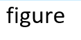

## Question
Use knitr to produce at least 3 examples (texts, figures, tables).

## Answer

1. This is the text. We needn't R to show text, only markdown can do it well.
2. This is a figure from external file.

<div align=center>

</div>

This a figure produced by R.
```{r}
plot(1:10)
```

3. This is a table.
```{r}
library(knitr)
kable(head(iris))
```

This is anather way to show table.
```{r xtable,results='asis'}
library(xtable)
print(xtable(head(iris)),type = 'html')
```
In fact, function xtable creates the tex code of tables, and function print make us see the table in html.


